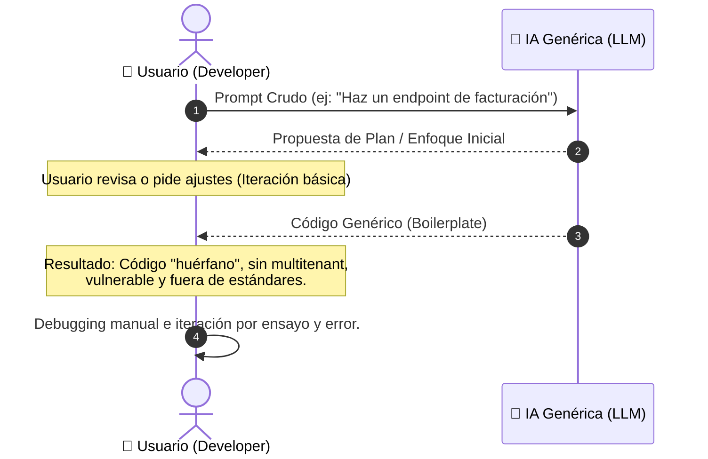
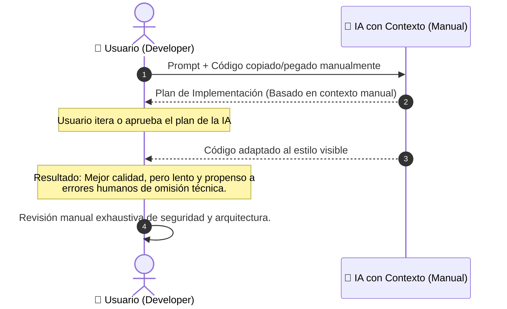
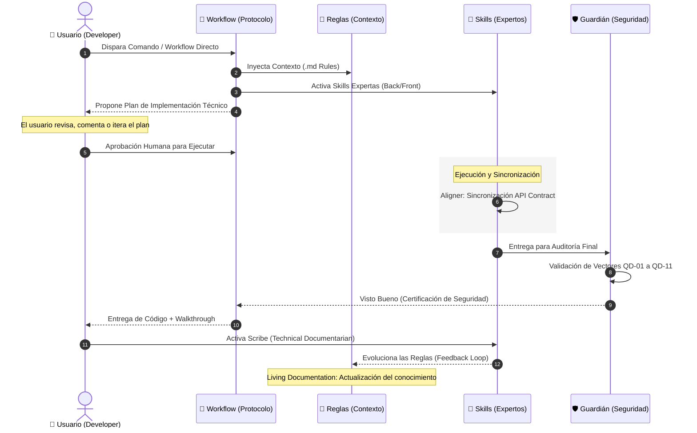
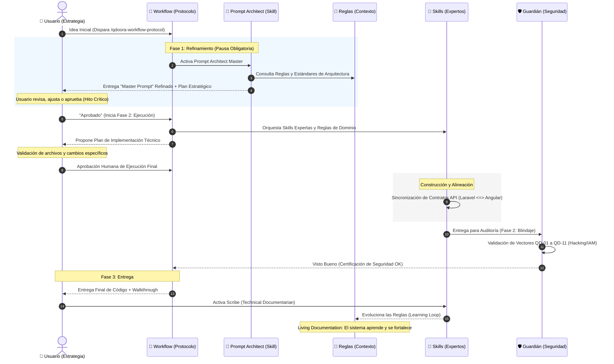

# Evolución de la Interacción con IA en QdoorA

Este documento detalla la transición desde el uso básico de IA hasta el **Ecosistema Agentico** de QdoorA, basado en el uso de **Rules, Skills y Workflows**.

---

### 🔴 Nivel 1: Desarrollo Ad-hoc (Caos sin Estructura)

En este nivel, la IA funciona de manera genérica. No hay conocimiento del proyecto, estándares de seguridad ni arquitectura. Por lo general es el uso que se le da cuando se conoce la herramienta.

---

### 🟡 Nivel 2: Chat Convencional (Contexto Manual)

La IA actúa como "Copiloto". El desarrollador intenta inyectar contexto copiando y pegando archivos o reglas. Es un proceso frágil y dependiente del humano. Practicamente es un prompt refinado por otro modelo de IA con algo de contexto que es lo que nosotros le entregamos.

---

### 🔵 Nivel 3: Ejecución Protocolizada (Sin Refinamiento)

El usuario utiliza las herramientas de QdoorA (**Workflows, Rules y Skills**) directamente. Se incluye el hito de validación del plan técnico y el ciclo de aprendizaje al finalizar la tarea.

---

### 🟢 Nivel 4: Ecosistema Agentico (Ciclo Completo)

Es el nivel de madurez absoluta. El sistema activa el protocolo `/qdoora-workflow-protocol` desde el inicio, asegurando que la estrategia sea perfecta antes de la ejecución.

---

### 🚀 ¿Por qué el Nivel 4 es superior?

La diferencia fundamental radica en el **Doble Check Humano** y la **Prevención**:
*   **Planificación Estratégica**: Mientras que en el Nivel 1 y 2 el plan es una "sugerencia" de la IA, en el Nivel 4 el plan es el resultado de auditar las **Rules** de QdoorA, lo que garantiza que el enfoque sea el correcto antes de escribir una sola línea.
*   **Orquestación desde el Inicio**: En el Nivel 4, el **Workflow** es quien manda, asegurando que se cumplan todas las fases (Refinamiento, Ejecución, Blindaje).
*   **Fases Estancas**: Separa el "Pensar" (Fase 1) del "Hacer" (Fase 2), eliminando errores por impulsividad de la IA.

---

### 📈 Mejora por Fases de Implementación (Workflow Protocol)

| Fase              | Beneficio del Protocolo QdoorA                    | Impacto en el Modelo de IA                                           |
| :---------------- | :------------------------------------------------ | :------------------------------------------------------------------- |
| **Refinamiento**  | Activación de **Prompt Architect** vía Workflow.  | Bloquea la ejecución prematura y refina la intención estratégica.    |
| **Validación**    | **Hito de Aprobación Obligatorio** (Fase 1).      | Asegura alineación total entre humano e IA antes de gastar recursos. |
| **Ejecución**     | Orquestación de **Skills** especializadas.        | Genera código de alta calidad basado en el Master Prompt aprobado.   |
| **Blindaje**      | Auditoría ofensiva del **Guardián** (Fase 2).     | Garantiza inmunidad ante vectores QD-01 a QD-11.                     |
| **Entrega**       | Documentación técnica vía **Scribe** (Fase 3).     | Cierra el círculo con aprendizaje automático de patrones nuevos.      |
