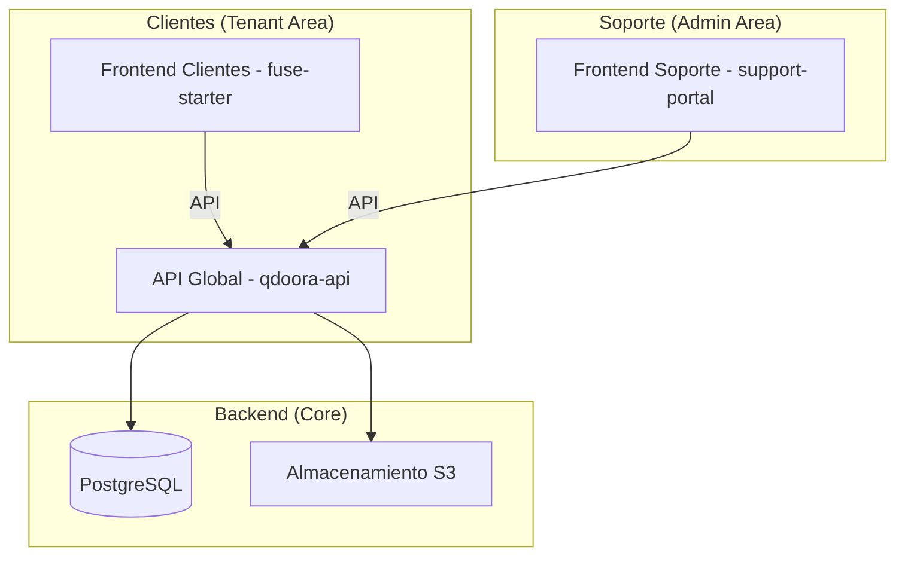

# 🛡️ Portal de Soporte QdoorA (3-Service Ecosystem)

Este documento detalla la arquitectura, estándares y flujos del ecosistema de soporte de QdoorA Chile. Este sistema está diseñado para ofrecer una experiencia premium tanto a clientes como a agentes de soporte, con un enfoque en la trazabilidad forense y la comunicación en tiempo real.

## 🏗️ Arquitectura General

El ecosistema se compone de tres servicios principales que interactúan a través de una API unificada:



### 1. API Global (`qdoora-api`)
*   **Tecnología**: Laravel 11.
*   **Responsabilidad**: Gestión de persistencia, reglas de negocio, control de acceso (RBAC), trazabilidad forense y comunicación con S3 para evidencias.
*   **Namespace**: `App\Services\Support`, `App\Http\Controllers\Support`, `App\Models\Support`.

### 2. Frontend Área Clientes (`fuse-starter`)
*   **Tecnología**: Angular 18/21.
*   **Responsabilidad**: Reporte de incidencias, centro de ayuda (Help Center) y chat de asistencia rápida integrado en el ERP.
*   **Componente Clave**: `QuickChatComponent`, `HelpCenterComponent`.

### 3. Frontend Área Soporte (`support-portal`)
*   **Tecnología**: Angular 21 (Vite-based, Architecture Zoneless).
*   **Responsabilidad**: Gestión avanzada de tickets, investigación forense, gestión de suscriptores y monitoreo de logs TI.
*   **Estándar**: Uso intensivo de **Signals**, `inject()` y patrones modernos de Angular.

---

## ⚙️ Backend: Estructura de Datos y Lógica

### Modelos Principales
*   **Ticket**: Entidad central que agrupa la incidencia, estado, prioridad y metadata.
*   **TicketInteraction**: Registro de comunicaciones entre cliente y soporte. Soporta notas internas invisibles para el cliente.
*   **TicketTraceability**: Log forense inmutable de cada cambio realizado en el ticket (IP, usuario, valor anterior/nuevo).
*   **TicketEvidence**: Referencias a archivos adjuntos en S3.

### Ciclo de Vida del Ticket (Status)
1.  **OPEN**: Ticket recién creado, sin atención.
2.  **IN_PROGRESS**: Siendo analizado por un agente de soporte.
3.  **PENDING_USER**: Soporte requiere validación o info del cliente.
4.  **RESOLVED**: Solución técnica aplicada.
5.  **CLOSED**: Finalizado formalmente (Inmutable).

---

## 🎨 Frontend Soporte: Estándares Premium

El `support-portal` sigue una estética de "Misión Crítica" y alta fidelidad corporativa, optimizada para la gestión de datos densos y flujos técnicos.

#### Estándar de Diseño Enterprise
Toda la interfaz del portal debe adherirse al patrón **Enterprise Premium** y respetar la estructura de estilos centralizada:
- **Centralización de Estilos**: Cualquier cambio de diseño DEBE estar estructurado y respetar los patrones definidos en [styles.css](file:///Users/francoalvaradotello/QdoorAChile/support-portal/src/styles.css). Queda prohibido el uso de valores "hardcoded" en los componentes.
- **Tokens de Diseño**: Nuevos colores, espaciados o fuentes deben declararse en el bloque `@theme` de Tailwind v4 en el archivo global de estilos.
- **Paleta Corporativa**: Uso predominante del azul corporativo (`#0052CC`) para elementos de acción primaria y estados activos.
- **Fondos Técnicos**: Empleo de fondos claros (`bg-slate-50`) con mallas de puntos o rejillas ultra-sutiles (`radial-gradient`).
- **Componentes de Vidrio**: Uso de `backdrop-blur` (Glassmorphism) en tarjetas y modales.
- **Identidad Ambiental**: Incorporación de decoraciones dinámicas con isotipos de marca difuminados.

#### Localización e Idioma (Innegociable)
- **Idioma Oficial**: Toda la interfaz de usuario, etiquetas, mensajes de error, notificaciones y placeholders DEBEN estar en **ESPAÑOL**.
- **Excepciones**: Solo se permiten términos técnicos de uso estándar en la industria (ej. *SLA, Token, JWT, Log, Ticket, Dashboard, SQS*) siempre que su traducción resulte ambigua o poco natural en el contexto técnico.

### Patrones de Desarrollo (Angular 21)
*   **Signals**: Todo el estado es reactivo vía `signal()`, `computed()` y `effect()`.
*   **Forensic Investigation**: La vista de gestión incluye una línea de tiempo técnica detallada.
*   **Live Chat**: Integración de chat en tiempo real con simulación de solicitudes para pruebas.
*   **Glassmorphism**: Uso de efectos de desenfoque y capas premium en la UI.

### Comandos de Utilidad en el Portal
```bash
# Iniciar portal de soporte
cd support-portal
npm run dev
```

---

## 🚨 Reglas para el Arquitecto (Full-Stack Architect)

Al trabajar en este módulo, el arquitecto debe asegurar:

1.  **Trazabilidad Obligatoria**: Cualquier cambio de estado en un ticket DEBE generar un registro en `support_ticket_traceability`.
2.  **Privacidad de Notas**: Las interacciones marcadas como `is_internal` NUNCA deben exponerse en el Frontend de clientes (`fuse-starter`).
3.  **Metadata Forense**: Los tickets generados automáticamente por el sistema deben incluir `event_id` y `erp_user_id` en el campo `metadata` para facilitar la investigación.
4.  **Zoneless Readiness**: El código en `support-portal` debe evitar `ChangeDetectorRef` y priorizar Signals para ser compatible con la arquitectura zoneless.
5.  **Idioma**: Validar que no existan cadenas de texto en inglés en las plantillas HTML o componentes.

---

## 🛠️ Comandos de Mantenimiento

### Backend
```bash
# Ejecutar migraciones de soporte
php artisan migrate --path=database/migrations/2026_04_21_233000_create_support_module_tables.php
```

### Frontend Support
```bash
# Generar nuevo módulo en el portal de soporte
ng generate component modules/nuevo-modulo --project support-portal
```

---
> [!TIP]
> Para investigar errores complejos, use la pestaña "Gestión Forense" en el Portal de Soporte para ver la traza técnica del evento vinculada al ticket.
