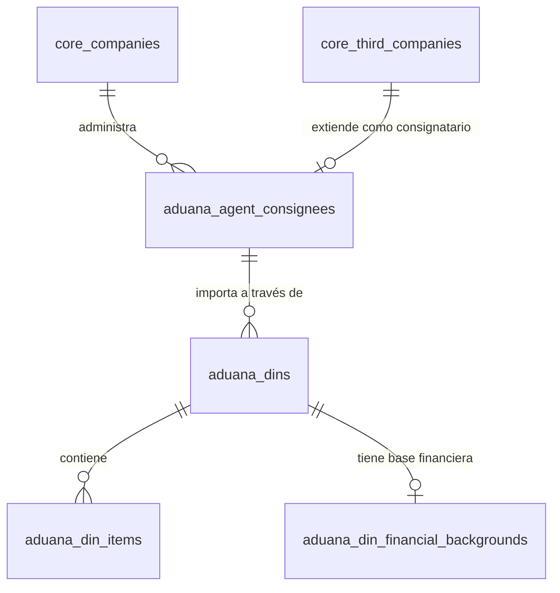

# Modelo de Datos: Aduana (Solo Módulos Integrados)

Este documento está podado para mostrar únicamente las entidades del módulo de Aduana que tienen relevancia directa o integración con Contabilidad y Core, específicamente las Declaraciones de Ingreso (DIN) y los Consignatarios.

## Diccionario de Datos

### Tabla: Consignatarios

- **`aduana_agent_consignees`**
  - `id`
  - `company_id` (foreign -> core_companies.id)
  - `third_company_id` (foreign -> core_third_companies.id)

- **`aduana_consignee_legal_representatives`**
  - `id`
  - `consignee_id` (foreign -> aduana_agent_consignees.id)
  - `identification_document_id` (foreign -> core_identification_documents.id)

### Tablas: Declaración de Ingreso (DIN)

- **`aduana_dins`**
  - `id`
  - `company_id` (foreign -> core_companies.id)
  - `consignee_id` (foreign -> aduana_agent_consignees.id)

- **`aduana_din_identifications`**
  - `id`
  - `din_id` (foreign -> aduana_dins.id)

- **`aduana_din_origin_transports`**
  - `id`
  - `din_id` (foreign -> aduana_dins.id)

- **`aduana_din_regimen_suspensives`**
  - `id`
  - `din_id` (foreign -> aduana_dins.id)

- **`aduana_din_financial_backgrounds`**
  - `id`
  - `din_id` (foreign -> aduana_dins.id)

- **`aduana_din_items`**
  - `id`
  - `din_id` (foreign -> aduana_dins.id)

- **`aduana_din_packages`**
  - `id`
  - `din_id` (foreign -> aduana_dins.id)

## Reglas de Integridad
- El consignatario (`aduana_agent_consignees`) es una extensión de la tabla central `core_third_companies`, lo que permite vincular la facturación y la contabilidad a un mismo RUT maestro.
- Todas las DINs pertenecen a una empresa (`company_id`).

## Diagrama Entidad-Relación (ERD)

