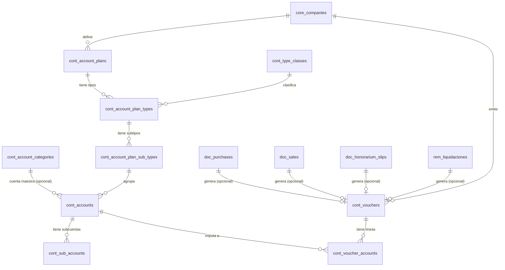

# Modelo de Datos: Contabilidad (Finanzas y Libros)

Este dominio concentra el corazón financiero del ERP: el Plan de Cuentas, la centralización de comprobantes (vouchers), y el registro de ventas, compras y tesorería.

## Diccionario de Datos

### Tablas de Dominio Contabilidad

- **`cont_ifrs`**
  - `id`

- **`cont_account_plans`**
  - `id`
  - `company_id` (foreign)

- **`cont_account_categories`** (cuentas maestras, catálogo global)
  - `id`
  - `code` (unique)
  - `allowed_type_codes` (json: códigos de Tipo permitidos)

- **`cont_type_classes`** (clases contables, catálogo global)
  - `id`
  - `code` (unique: `ACTIVO`, `PASIVO`, `PATRIMONIO`, `GANANCIA`, `PERDIDA`)
  - `name`
  - `required` (boolean; solo `PATRIMONIO` = false)

- **`cont_account_plan_types`**
  - `id`
  - `account_plan_id` (foreign)
  - `code` (varchar(1))
  - `type_class_code` (foreign → `cont_type_classes.code`, nullable)

- **`cont_account_plan_sub_types`**
  - `id`
  - `account_plan_type_id` (foreign)

- **`cont_accounts`**
  - `id`
  - `account_plan_sub_type_id` (foreign)
  - `company_id` (foreign)

- **`cont_sub_accounts`**
  - `id`
  - `account_id` (foreign)
  - `company_id` (foreign)

- **`cont_auxiliary_companies`**
  - `id`
  - `company_id` (foreign)
  - `third_company_id` (foreign)

- **`cont_auxiliary_accounts`**
  - `id`
  - `auxiliary_id` (foreign)
  - `account_id` (foreign)
  - `sub_account_id` (foreign)
  - `company_id` (foreign)

- **`cont_account_category_documents`**
  - `id`

- **`cont_voucher_types`**
  - `id`
  - `company_id` (foreign)

- **`cont_accounting_types`**
  - `id`

- **`cont_tax_accounts`**
  - `id`
  - `company_id` (foreign)
  - `tax_id` (foreign)
  - `account_purchase_id` (foreign)
  - `account_sale_id` (foreign)

- **`cont_document_tax_restrictions`**
  - `id`
  - `document_id` (foreign)
  - `tax_id` (foreign)

- **`doc_purchases`**
  - `id`
  - `company_id` (foreign)

- **`doc_purchase_items`**
  - `id`
  - `purchase_id` (foreign)

- **`doc_sales`**
  - `id`
  - `company_id` (foreign)

- **`doc_sale_items`**
  - `id`
  - `sale_id` (foreign)

- **`cont_tax_codes_iva`**
  - `id`

- **`doc_honorarium_slips`**
  - `id`
  - `company_id` (foreign)

- **`doc_honorarium_slip_items`**
  - `id`
  - `honorarium_slip_id` (foreign)

- **`cont_treasury_operations`**
  - `id`
  - `company_id` (foreign)

- **`cont_treasury_applications`**
  - `id`
  - `treasury_operation_id` (foreign)

- **`cont_product_accounts`**
  - `id`
  - `company_id` (foreign)

- **`cont_party_accounts`**
  - `id`
  - `company_id` (foreign)

- **`cont_payroll_accounts`**
  - `id`
  - `company_id` (foreign)

- **`cont_vouchers`**
  - `id`
  - `company_id` (foreign)

- **`cont_voucher_accounts`**
  - `id`
  - `voucher_id` (foreign)
  - `company_id` (foreign)

## Reglas de Integridad
- Todo registro contable (`cont_vouchers`) mantiene el principio de partida doble.
- Multi-Tenancy: Todas las tablas operativas requieren `company_id`.

## Diagrama Entidad-Relación (ERD)

