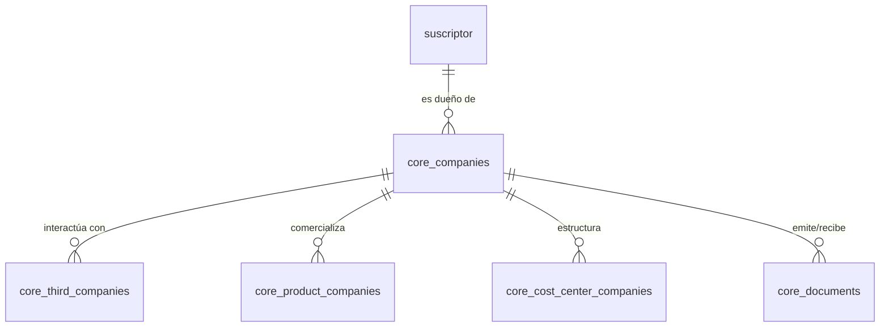

# Modelo de Datos: Core (Empresa y Parámetros Globales)

Este dominio abarca la definición de las empresas (`core_companies`), los terceros con los que interactúan (`core_third_companies`), y la configuración global transversal del ERP.

## Diccionario de Datos

### Tablas de Dominio Core

- **`core_companies`**
  - `id`
  - `suscriptor_id` (foreign -> suscriptor.id)
  - `type_company_id` (foreign -> core_company_types.id)
  - `tax_regime_id` (foreign -> core_tax_regimes.id)
  - `comuna_id` (foreign -> core_comunas.id)
  - `currency_id` (foreign -> core_currencies.id)
  - `economic_activity_sii_id` (foreign -> core_economic_activities_sii.id)
  - `contributor_category_id` (foreign -> core_contributor_categories.id)

- **`core_third_companies`**
  - `id`
  - `company_id` (foreign -> core_companies.id)
  - `identification_document_id` (foreign -> core_identification_documents.id)

- **`core_cost_center_companies`**
  - `id`
  - `company_id` (foreign -> core_companies.id)

- **`core_branch_companies`**
  - `id`
  - `company_id` (foreign -> core_companies.id)

- **`core_product_companies`**
  - `id`
  - `company_id` (foreign -> core_companies.id)
  - `product_category_id` (foreign -> core_product_categories.id)
  - `product_type_id` (foreign -> core_product_types.id)
  - `product_measure_unit_id` (foreign -> core_product_measure_units.id)

- **`core_product_categories`**
  - `id`
  - `company_id` (foreign -> core_companies.id)

- **`core_product_types`**
  - `id`

- **`core_product_measure_units`**
  - `id`

- **`core_product_taxes`**
  - `id`
  - `product_id` (foreign -> core_product_companies.id)
  - `tax_id` (foreign -> core_taxes.id)

- **`core_documents`**
  - `id`
  - `company_id` (foreign -> core_companies.id)

- **`core_external_systems`**
  - `id`

- **`core_series`**
  - `id`
  - `external_system_id` (foreign -> core_external_systems.id)

- **`core_exchange_rate_cache`**
  - `id`
  - `series_id` (foreign -> core_series.id)

- **`core_taxes`**
  - `id`

- **`core_currencies`**
  - `id`

- **`core_payment_methods`**
  - `id`

- **`core_identification_documents`**
  - `id`

- **`core_note_credit_types`**
  - `id`

- **`core_note_debit_types`**
  - `id`

- **`core_countries`**
  - `id`

- **`core_cities`**
  - `id`
  - `country_id` (foreign -> core_countries.id)

- **`core_comunas`**
  - `id`
  - `city_id` (foreign -> core_cities.id)

- **`core_company_types`**
  - `id`

- **`core_tax_regimes`**
  - `id`

- **`core_contributor_categories`**
  - `id`

- **`core_economic_activities_sii`**
  - `id`

## Reglas de Integridad
- **Multi-Tenancy Estricto:** Toda tabla operativa dentro de Core o módulos derivados debe tener la columna `company_id` para garantizar el aislamiento de datos entre empresas.
- **Normalización de Entidades:** Un tercero (`core_third_companies`) existe solo una vez por `company_id`.

## Diagrama Entidad-Relación (ERD)

