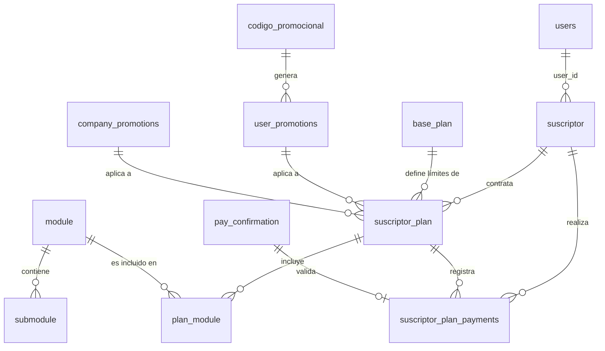

# Modelo de Datos: Planes y Suscripciones (Billing)

Este dominio abarca la gestión comercial del ERP: planes base, promociones, control de módulos y el historial de pagos de un suscriptor.

## Diccionario de Datos

### Tablas de Dominio Planes

- **`base_plan`**
  - `id`

- **`codigo_promocional`**
  - `id`

- **`user_promotions`**
  - `id`

- **`company_promotions`**
  - `id`

- **`suscriptor_plan`**
  - `id`
  - `base_plan_id` (foreign -> base_plan.id)
  - `suscriptor_id` (foreign -> suscriptor.id)
  - `user_promotions_id` (foreign -> user_promotions.id)
  - `company_promotions_id` (foreign -> company_promotions.id)

- **`module`**
  - `code` (PK)

- **`submodule`**
  - `code` (PK)
  - `module` (foreign -> module.code)

- **`plan_module`**
  - `id`
  - `module` (foreign -> module.code)
  - `suscriptor_plan_id` (foreign -> suscriptor_plan.id)

- **`pay_confirmation`**
  - `id`

- **`suscriptor_plan_payments`**
  - `id`
  - `suscriptor_id` (foreign -> suscriptor.id)
  - `suscriptor_plan_id` (foreign -> suscriptor_plan.id)
  - `payu_confirmation_id` (foreign -> pay_confirmation.id)

## Reglas de Integridad
- Todo pago o validación comercial se ancla a `suscriptor_plan`.
- Los módulos habilitados (`plan_module`) controlan qué aplicaciones de QdoorA (Contabilidad, Nómina) están visibles para un Tenant.

## Diagrama Entidad-Relación (ERD)

