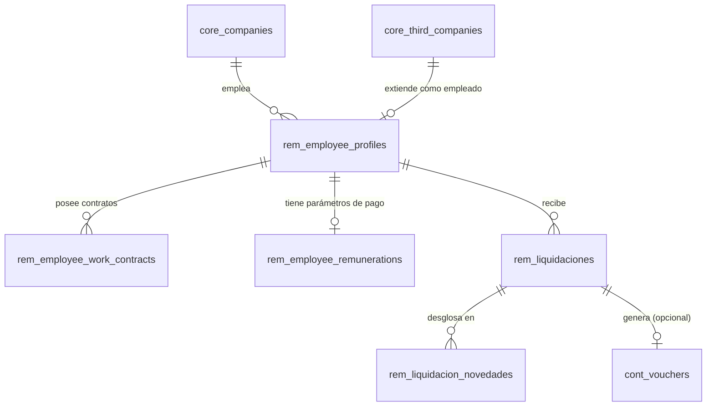

# Modelo de Datos: Remuneraciones (Nómina y RRHH)

Este dominio abarca el ciclo de vida laboral de los empleados, sus contratos, haberes/descuentos y el cálculo mensual de liquidaciones.

## Diccionario de Datos

### Tablas de Dominio Remuneraciones

- **`rem_global_features`**
  - `id`

- **`rem_global_earnings_discounts`**
  - `id`

- **`rem_company_settings`**
  - `id`
  - `company_id` (foreign -> core_companies.id)

- **`rem_payroll_earnings_discounts`**
  - `id`
  - `company_id` (foreign -> core_companies.id)

- **`rem_employee_profiles`**
  - `id`
  - `company_id` (foreign -> core_companies.id)
  - `third_company_id` (foreign -> core_third_companies.id)

- **`rem_employee_familiar_charges`**
  - `id`
  - `employee_profile_id` (foreign -> rem_employee_profiles.id)

- **`rem_employee_work_contracts`**
  - `id`
  - `employee_profile_id` (foreign -> rem_employee_profiles.id)

- **`rem_employee_remunerations`**
  - `id`
  - `employee_profile_id` (foreign -> rem_employee_profiles.id)

- **`rem_employee_scheduled_movements`**
  - `id`
  - `employee_profile_id` (foreign -> rem_employee_profiles.id)

- **`rem_liquidaciones`**
  - `id`
  - `employee_profile_id` (foreign -> rem_employee_profiles.id)
  - `company_id` (foreign -> core_companies.id)
  - `accounting_status`
  - `sii_status`

- **`rem_liquidacion_novedades`**
  - `id`
  - `liquidacion_id` (foreign -> rem_liquidaciones.id)

## Reglas de Integridad
- Todo empleado se enlaza a la tabla central `core_third_companies`.
- Los registros financieros y laborales de un empleado deben contener siempre el contexto de la empresa (`company_id`).

## Diagrama Entidad-Relación (ERD)

