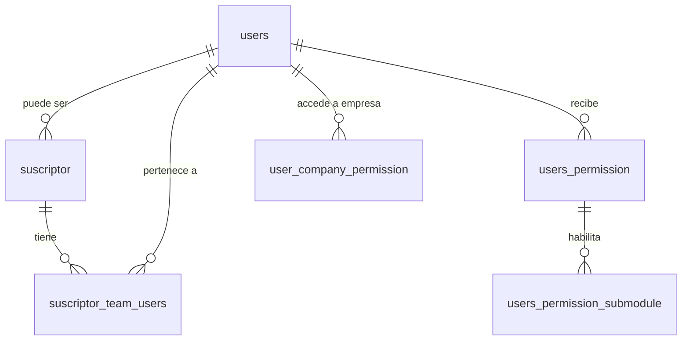

# Modelo de Datos: Usuarios, Permisos y Seguridad (IAM)

Este dominio abarca la capa transversal de seguridad, roles, autenticación y el sistema universal de Logging.

## Diccionario de Datos

### Tablas de Dominio Usuarios y Permisos

- **`users`**
  - `id`

- **`suscriptor`**
  - `id`
  - `user_id` (foreign -> users.id)

- **`suscriptor_team_users`**
  - `id`
  - `suscriptor_id` (foreign -> suscriptor.id)
  - `user_id` (foreign -> users.id)

- **`roles`**
  - `id`

- **`users_permission`**
  - `id`
  - `user_id` (foreign -> users.id)
  - `role_id` (foreign -> roles.id)
  - `suscriptor_id` (foreign -> suscriptor.id)

- **`users_permission_submodule`**
  - `id`
  - `users_permission_id` (foreign -> users_permission.id)
  - `submodule_code` (foreign -> submodule.code)

- **`role_submodule_permissions`**
  - `id`
  - `role_id` (foreign -> roles.id)

- **`user_company_permission`**
  - `id`
  - `user_id` (foreign -> users.id)
  - `company_id` (foreign -> core_companies.id)

- **`password_reset_tokens`**
  - `email` (PK)

- **`sessions`**
  - `id`

- **`personal_access_tokens`**
  - `id`

### Tablas de Sistema y Logging

- **`logger_type`**
  - `id`

- **`logger_operation`**
  - `id`

- **`logger_event`**
  - `id`

- **`logger_data`**
  - `id`
  - `user_id` (foreign -> users.id)
  - `type_id` (foreign -> logger_type.id)
  - `operation_id` (foreign -> logger_operation.id)
  - `event_id` (foreign -> logger_event.id)

- **`support_tags`**
  - `id`

- **`support_tickets`**
  - `id`
  - `user_id` (foreign -> users.id)
  - `suscriptor_id` (foreign -> suscriptor.id)

- **`support_ticket_tag`**
  - `id`
  - `ticket_id` (foreign -> support_tickets.id)
  - `tag_id` (foreign -> support_tags.id)

- **`support_ticket_interactions`**
  - `id`
  - `ticket_id` (foreign -> support_tickets.id)

- **`support_ticket_traceability`**
  - `id`
  - `ticket_id` (foreign -> support_tickets.id)

- **`support_ticket_evidences`**
  - `id`
  - `ticket_id` (foreign -> support_tickets.id)

- **`support_help_categories`**
  - `id`

- **`support_help_articles`**
  - `id`
  - `category_id` (foreign -> support_help_categories.id)

## Reglas de Integridad
- Los usuarios base viven en `users`, y su contexto de arrendatario (Tenant) se marca en `suscriptor`.
- El acceso granular a un módulo particular para un usuario depende de `users_permission_submodule` y `user_company_permission`.

## Diagrama Entidad-Relación (ERD)

